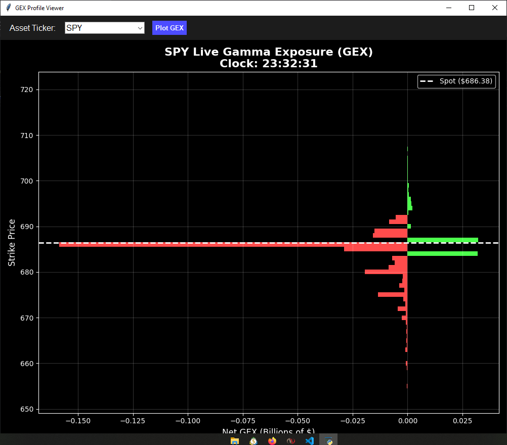

Here is a sleek, formatted README.md file tailored for your GitHub repository. It uses standard GitHub Markdown (Headers, Bold, Italic, Code Blocks, Emojis, and some formatting tricks) to make it look professional and colorful!

Copy and paste the text below into your README.md file:

code
Markdown
download
content_copy
expand_less
# 📈 Live GEX (Gamma Exposure) Profile Tracker

> A blazing-fast, multithreaded Python tool that calculates and visualizes real-time Gamma Exposure (GEX) for options markets.

By calculating the Black-Scholes Gamma for current option chains, this tool visualizes where Market Makers are positioned, helping you spot heavy support/resistance levels and potential volatility zones in real-time.

---

## ✨ Key Features

* 🚀 **Blazing Fast Math:** Uses `numpy` and `scipy` vectorization to calculate the Black-Scholes Greeks for hundreds of strikes in milliseconds.
* 🧵 **Multithreaded Architecture:** Fetches data from Yahoo Finance in a background thread so the UI never freezes or lags.
* ⏱️ **Live Auto-Updating:** The chart updates seamlessly with a 1-second ticking clock and auto-refreshing data.
* 🎨 **Sleek UI:** Dark mode by default, auto-centered layout, and stripped of clunky toolbars for a clean, widget-like aesthetic.
* 🛡️ **Rate-Limit Protected:** Includes error handling to detect and warn you if Yahoo Finance temporarily blocks your IP.

---

## 🛠️ Installation & Requirements

You will need Python installed on your system. To install the required libraries, run the following command in your terminal:

pip install yfinance pandas numpy scipy matplotlib
🚀 How to Use

Clone or download the script (gex_tracker.py).

Run the script via your terminal or IDE:

code
Bash
download
content_copy
expand_less
python gex_tracker.py

Change the Ticker: To track a different stock, open the Python file and change the settings at the top:

code
Python
download
content_copy
expand_less
# . SETTINGS ---
TICKER = "QQQ"           # Change this to AAPL, TSLA, NVDA, etc.
DATA_REFRESH_SEC = 2     # How often to download new data
📊 How to Read the Chart

The chart displays the Net Gamma Exposure (in Billions of dollars) on the X-axis, and the Strike Price on the Y-axis.

🟢 Green Bars (Positive GEX / Call Walls)

Dealers are Long Gamma. As price approaches these strikes, dealers will trade against the trend (selling the rips, buying the dips). This acts as a magnet and heavy resistance/support keeping the market calm.

🔴 Red Bars (Negative GEX / Put Walls)

Dealers are Short Gamma. If the price drops into these zones, dealers are forced to sell into the drop to hedge their risk. This acts as a volatility accelerator, meaning the price can move very fast and violently through these strikes.

⚪ Dotted White Line

The current, live Spot Price of the underlying asset.

⚠️ Disclaimer

This script pulls data from Yahoo Finance's unofficial API (yfinance). If you set the DATA_REFRESH_SEC too low (e.g., updating every 0.5 seconds), Yahoo may temporarily rate-limit or block your IP address. A safe refresh rate is between 2 to 10 seconds.

Not Financial Advice. This tool is for educational and research purposes only. Options trading carries significant risk.

code
Code
download
content_copy
expand_less
Once you paste that, GitHub will read the ` ``` ` backticks correctly, the code blocks will close properly, and the rest of your headers and colors will pop back out into standard text!
